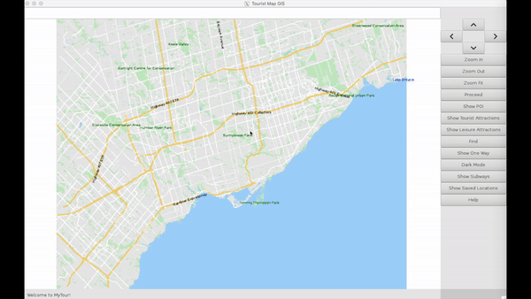
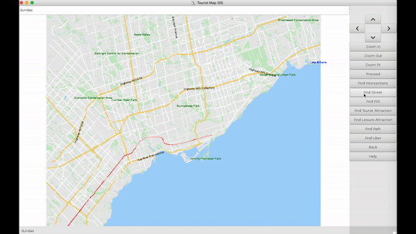
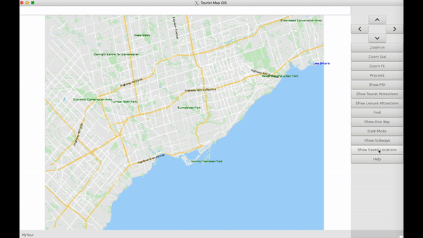

# MyTour
MyTour is a Geographic Information System (GIS) software program that queries an OpenStreetMap database to allow users to visualize and solve travel and optimization problems in maps of any city of the world. It is able to

- Read in a database of all the intersections and streets and other geographic features in a city and organize it into appropriate data structures.
- Draw the resulting map nicely and let the user interact (pan, zoom, highlight, search for locations, etc.) with it.
- Find the shortest travel route between any two intersections in the city and give directions to the user.
- Find an efficient order of deliveries and an optimized driving path for a courier company driver to complete
his/her list of daily deliveries.

## Demo
This demo shows how the application can be used to navigate the map of Toronto.

### Zooming and Moving Around
Users can zoom in and out and move around to explore a city.

### Showing Physical Features
#### Showing Points of Interest (POI)

#### Showing Subways

### Finding
#### Finding Streets
Users can search for streets in a city. Minor spelling mistakes will not prevent the correct street being found.

#### Finding Points of Interest (POI)
Users can search for POI in a city. Minor spelling mistakes will not prevent the correct POI being found.

#### Finding Paths
Users can use the interface to find the shortest path between two points. The A* path-finding algorithm is used to find this path efficiently. Users have the option to click on the starting and ending intersections:

Or they can type the two street names that define each intersection:

### Darkmode

